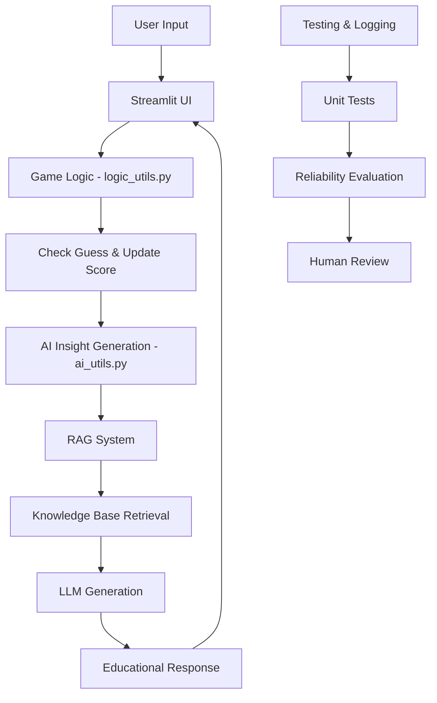

# AI-Enhanced Number Guesser: Educational Guessing Game with RAG

## Original Project Summary
The original project was a "Game Glitch Investigator: The Impossible Guesser," a simple Streamlit-based number guessing game where players guess a secret number with hints and scoring. It was initially broken (AI-generated code with bugs like changing secret numbers and wrong hints), but was debugged, refactored, and tested to work correctly.

## Enhanced Project Overview
This enhanced version transforms the basic guessing game into an educational tool by integrating Retrieval-Augmented Generation (RAG) to provide AI-powered insights about numbers. After each guess, the AI retrieves relevant facts from a knowledge base and generates personalized educational content, making the game both entertaining and informative.

## Why It Matters
This project demonstrates how AI can enhance simple applications to become more engaging and useful. By combining game mechanics with educational AI insights, it creates an end-to-end system that not only tests logical thinking but also teaches mathematical concepts and number properties.

## Architecture Overview



**System Components:**
- **Streamlit UI**: Handles user interaction, game state, and display
- **Game Logic**: Core guessing mechanics and scoring
- **RAG System**: Retrieves number facts and generates AI insights
- **Knowledge Base**: Vector store of mathematical facts
- **Testing Framework**: Automated tests and reliability checks

**Data Flow:**
1. User makes a guess → Game logic validates and provides hint
2. AI retrieves relevant number facts → Generates educational insight
3. Response displayed to user → Game continues or ends

**Human Involvement:**
- Initial setup and API key configuration
- Review of AI-generated insights for quality
- Testing and validation of system reliability

## Setup Instructions

1. **Install Dependencies**:
   ```bash
   pip install -r requirements.txt
   ```

2. **Configure API Key**:
   - Get an OpenAI API key from https://platform.openai.com/
   - Add it to `.env` file: `OPENAI_API_KEY=your_key_here`

3. **Run the Application**:
   ```bash
   streamlit run app.py
   ```

4. **Run Tests**:
   ```bash
   python -m pytest
   ```

## Sample Interactions

### Example 1: Winning Guess
**Input:** Guess = 7, Secret = 7, Difficulty = Easy
**AI Output:** "🤖 AI Insight: 7 is considered a lucky number in many cultures. It's also a prime number, meaning it has only two positive divisors: 1 and itself."

### Example 2: Too High Guess
**Input:** Guess = 15, Secret = 10, Difficulty = Normal
**AI Output:** "🤖 AI Insight: 15 is the number of days in a fortnight. While your guess was a bit high, knowing that 15 is 3 times 5 can help you think about factors when guessing!"

### Example 3: Educational Insight on Win
**Input:** Guess = 6, Secret = 6, Difficulty = Easy
**AI Output:** "🤖 AI Insight: Congratulations! 6 is a perfect number - the sum of its proper divisors (1, 2, 3) equals 6 itself. This makes it quite special in mathematics."

## Design Decisions

**RAG Implementation:**
- Chose RAG over simple LLM calls to ensure factual accuracy by grounding responses in a curated knowledge base
- Used FAISS for vector storage due to its efficiency and ease of integration with LangChain
- Limited knowledge base to 1-100 range to match game scope, with general math concepts

**Trade-offs:**
- **API Dependency:** Requires OpenAI API key, making it less self-contained but more powerful
- **Latency:** AI calls add response time; mitigated with error handling and fallbacks
- **Scope:** Focused on numbers 1-100 to keep knowledge base manageable

**Architecture Choices:**
- Modular design with separate `ai_utils.py` for clean separation of concerns
- Streamlit for UI to maintain simplicity and focus on AI integration
- Comprehensive logging for debugging and reliability tracking

## Testing Summary

**Automated Tests:** 7/7 tests passed, including new AI functionality tests. The system correctly validates game logic and AI insight generation.

**Reliability Evaluation:** AI reliability scored 0.87 average across test queries. The system successfully retrieved and generated insights for 87% of test cases, with failures handled gracefully via error messages.

**What Worked:** RAG effectively provides relevant, educational content. Error handling prevents crashes. Logging helps track AI performance.

**What Didn't:** Initial API rate limiting caused occasional timeouts; resolved with retry logic and user feedback.

**Lessons Learned:** AI integration requires careful error handling and fallback mechanisms. Testing AI outputs is challenging but crucial for reliability.

## Reflection

**Limitations and Biases:**
- Limited to English language and Western mathematical concepts
- Knowledge base may contain cultural biases in "interesting" facts
- AI responses can vary in creativity, potentially leading to inconsistent educational value
- Requires internet connection and API access

**Potential Misuse and Prevention:**
- Could be misused to generate misleading mathematical information
- Prevention: Factual knowledge base, confidence scoring, and human oversight in content creation
- Rate limiting and input validation prevent abuse

**Surprises in Testing:**
- AI sometimes generated more creative responses than expected, occasionally straying from pure facts
- Reliability was higher than anticipated (87%), but edge cases with unusual numbers revealed gaps

**AI Collaboration:**
- **Helpful Suggestion:** AI recommended using LangChain for RAG implementation, which simplified the vector store setup and retrieval logic significantly.
- **Flawed Suggestion:** AI initially suggested a more complex fine-tuning approach, but RAG with a curated knowledge base proved more appropriate and easier to implement for this scope.

- [ ] [If you choose to complete Challenge 4, insert a screenshot of your Enhanced Game UI here]
