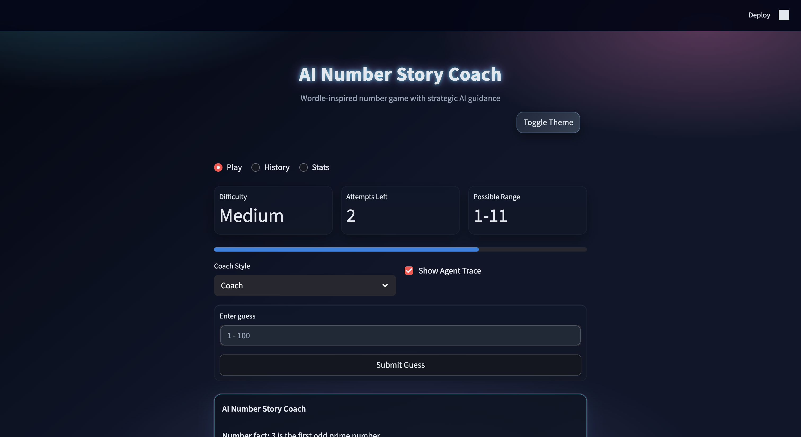

# AI Number Story Coach: A Reliable, Game-Style Number Guessing System

## Platform Landing Page


## Video Demo
https://www.loom.com/share/f6e5144e2f7844da9d0084f31c57d83b

## Slides
[View Slides (PDF)](./slides.pdf)

## Title and Summary
AI Number Story Coach is a Wordle-inspired number guessing game that combines classic game logic with an integrated AI guidance layer. Instead of acting like a separate chatbot, the AI is part of the turn-by-turn gameplay: after each valid guess, it explains the number, gives safe directional strategy, and helps the player narrow the range. This project matters because it demonstrates how to build an engaging AI product with guardrails, fallback behavior, testing, and observable reliability.

## Platform Landing Page


## Video Demo
https://www.loom.com/share/f6e5144e2f7844da9d0084f31c57d83b

## Slides
/Users/amenu/JAVA/applied-ai-system-project/AI_Number_Story_Coach_Building_a_Reliable_Applied_AI_Game_System.pdf

## Original Project (Modules 1–3)
The original project from Modules 1–3 was **Number Guessing Game**. Its initial goal was to let users guess a hidden number with basic high/low feedback and simple win/loss handling. It provided core mechanics (input, comparison, attempts) but had limited UX depth, minimal persistence, and no robust AI safety workflow.

## What This Version Adds
- Start screen with difficulty modes and clear rules
- Wordle-style guess feedback cards
- AI Number Story Coach with strict structured output
- Local fact lookup for numbers (`1–500`) with special-fact priority
- AI safety checker + deterministic fallback hint
- Tabs for `Play`, `History`, and `Stats`
- Light/Dark theme toggle and saved preference
- Score model using difficulty, attempts, time, and AI usage
- Persistent run artifacts (`.game_history.json`, `.game_stats.json`, `.ui_prefs.json`)

## Architecture Overview
The architecture is documented with two diagrams:
- Light architecture: [number-game-architecture-dark.svg](/Users/amenu/JAVA/applied-ai-system-project/number-game-architecture-light.svg)
- Dark pipeline architecture: [number-game-architecture-light.svg](/Users/amenu/JAVA/applied-ai-system-project/number-game-architecture-dark.svg)

High-level flow:
1. Player submits a guess.
2. Validator checks type/range/repetition.
3. State engine updates attempts, history, range, and score state.
4. Local fact retriever provides one concise fact for guessed number.
5. AI Story Coach generates structured hint JSON.
6. Safety checker validates schema, direction correctness, and no answer leakage.
7. UI renders guess card + AI story card; stats/history persist to disk.
8. Pytest + human review loop feeds improvements back into facts, rules, prompts, and UX.

## Setup Instructions
1. Clone the repo.
2. Create and activate a Python environment.
3. Install dependencies:
```bash
pip install -r requirements.txt
```
4. (Optional) Add OpenAI key in `.env`:
```bash
OPENAI_API_KEY=your_openai_api_key
```
5. Run app:
```bash
python3 -m streamlit run app.py
```
6. Run tests:
```bash
python3 -m pytest -q
```

## Sample Interactions
### Example 1: Normal guided turn
Input:
- Difficulty: `Medium` (1–100)
- Guess: `65`

Resulting AI output (shape):
```json
{
  "numberFact": "65 is the product of 5 and 13.",
  "direction": "higher",
  "rangeAdvice": "Current practical range is 66 to 100.",
  "targetClue": "The target is still hidden inside that range.",
  "nextStrategy": "Use midpoint strategy to split the remaining range efficiently.",
  "confidence": "medium"
}
```

### Example 2: Special fact priority
Input:
- Guess: `89`

Result:
- System uses special local fact first: `89 is a prime number and also a Fibonacci number.`
- AI guidance still gives safe direction/range strategy and does not reveal target.

### Example 3: Safety fallback path
Input:
- AI returns malformed or unsafe content (wrong direction or answer leak)

Result:
- Safety checker blocks AI response.
- Fallback shown:
  - “Your guess helped narrow the search. Use the higher/lower feedback and try a number near the middle of the remaining range.”

## Design Decisions and Trade-offs
- **Decision:** AI is integrated into gameplay, not separate chat.
  - **Trade-off:** Tighter coupling to game state, but more useful and contextual hints.
- **Decision:** Local number facts for deterministic behavior.
  - **Trade-off:** Larger static data footprint, but prevents random fact drift.
- **Decision:** Strict JSON contract and safety validation.
  - **Trade-off:** Some AI responses are rejected, but reliability and trust improve.
- **Decision:** File-based persistence.
  - **Trade-off:** Simpler local deployment than database-backed storage.


## Reliability and Evaluation
This project includes multiple reliability mechanisms:
- Automated tests: `python3 -m pytest -q` currently passes (`13 passed`).
- Confidence scoring: AI responses include `low | medium | high`, and `ai_evaluation.py` maps those labels to numeric scores for reporting.
- Logging and error handling: gameplay and AI failures are logged; unsafe AI output is blocked and replaced with deterministic fallback.
- Human evaluation: use [human_evaluation_template.md](/Users/amenu/JAVA/applied-ai-system-project/human_evaluation_template.md) for manual review of output quality and UX clarity.

Example evaluation summary (from `python3 ai_evaluation.py`):
- `6 out of 6 checks passed; confidence scores averaged 0.70.`
- Reliability improved through schema validation, direction checks, and safe fallback behavior.

## Testing Summary
What worked:
- Range generation and win/loss logic
- Invalid/repeated guess protection (no attempt consumption)
- AI safety checks for no answer reveal and direction correctness
- Fallback behavior when validation fails
- Persistence read/write for history, stats, and theme preference

What did not work initially:
- Theme CSS accidentally hid toolbar/button labels in light mode
- Some fact behavior mismatches between “special” and fallback paths

What changed:
- Refined CSS targeting and toolbar/button styling
- Added special-fact prioritization and aligned tests accordingly

Current status:
- Test suite passing (`13 passed`)

## Reflection
This project reinforced that strong AI products are systems. The most important work was in boundaries: defining what AI is allowed to do, validating outputs before display, and maintaining reliable fallbacks. It also showed how game design and reliability engineering can complement each other: engaging UX keeps users involved, while guardrails and tests keep outcomes trustworthy.

## Repository Structure (Key Files)
- [app.py](/Users/amenu/JAVA/applied-ai-system-project/app.py): Streamlit UI and gameplay orchestration
- [logic_utils.py](/Users/amenu/JAVA/applied-ai-system-project/logic_utils.py): core game rules, scoring, persistence helpers
- [ai_utils.py](/Users/amenu/JAVA/applied-ai-system-project/ai_utils.py): AI story generation, validation, fallback
- [numberFacts.js](/Users/amenu/JAVA/applied-ai-system-project/numberFacts.js): local number fact system for `1–500`
- [tests/test_game_logic.py](/Users/amenu/JAVA/applied-ai-system-project/tests/test_game_logic.py): reliability and logic tests
