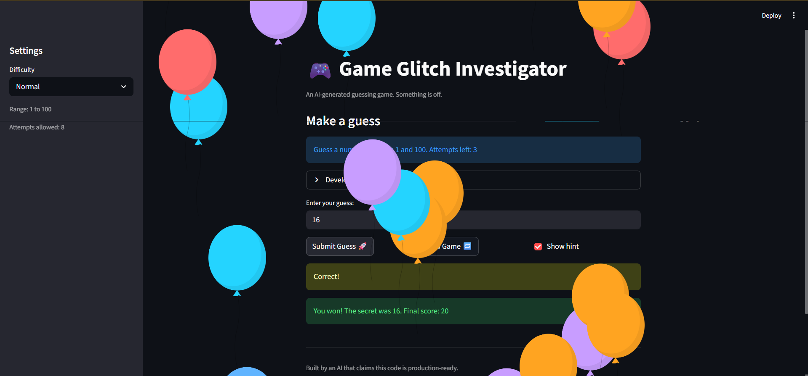
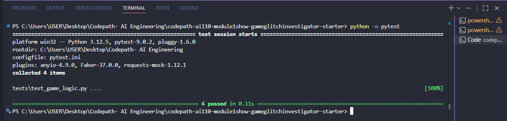

# Game Glitch Investigator: The Impossible Guesser

## The Situation

You asked an AI to build a simple "Number Guessing Game" using Streamlit.
It wrote the code, ran away, and now the game is unplayable.

- You can't win.
- The hints lie to you.
- The secret number seems to have commitment issues.

## Setup

1. Install dependencies: `pip install -r requirements.txt`
2. Run the broken app: `python -m streamlit run app.py`

## Your Mission

1. **Play the game.** Open the "Developer Debug Info" tab in the app to see the secret number. Try to win.
2. **Find the State Bug.** Why does the secret number change every time you click "Submit"? Ask ChatGPT: *"How do I keep a variable from resetting in Streamlit when I click a button?"*
3. **Fix the Logic.** The hints ("Higher/Lower") are wrong. Fix them.
4. **Refactor & Test.**
   - Move the logic into `logic_utils.py`.
   - Run `pytest` in your terminal.
   - Keep fixing until all tests pass!

## Document Your Experience

- [x] Describe the game's purpose.
  The purpose of the game is to let the player guess a secret number based on the selected difficulty while tracking attempts and score in a Streamlit app.
- [x] Detail which bugs you found.
  I found that the hint logic was backwards, so the game told me to go higher when my guess was already too high. I also found that the app used inconsistent value types during comparison, which could break the result logic, and the New Game button did not fully reset the game state.
- [x] Explain what fixes you applied.
  I refactored the core logic into `logic_utils.py`, fixed the high/low comparison messages in `check_guess()`, removed the mixed string and integer comparison bug, and added pytest coverage with a regression test for the `9` versus `"10"` case.

## Demo

- [x] Fixed winning game screenshot

## Challenge 1: Advanced Edge-Case Testing

- [x] Added pytest coverage for game logic edge cases
- [x] Added a regression test for numeric string comparison

## Stretch Features

- [ ] [If you choose to complete Challenge 4, insert a screenshot of your Enhanced Game UI here]
